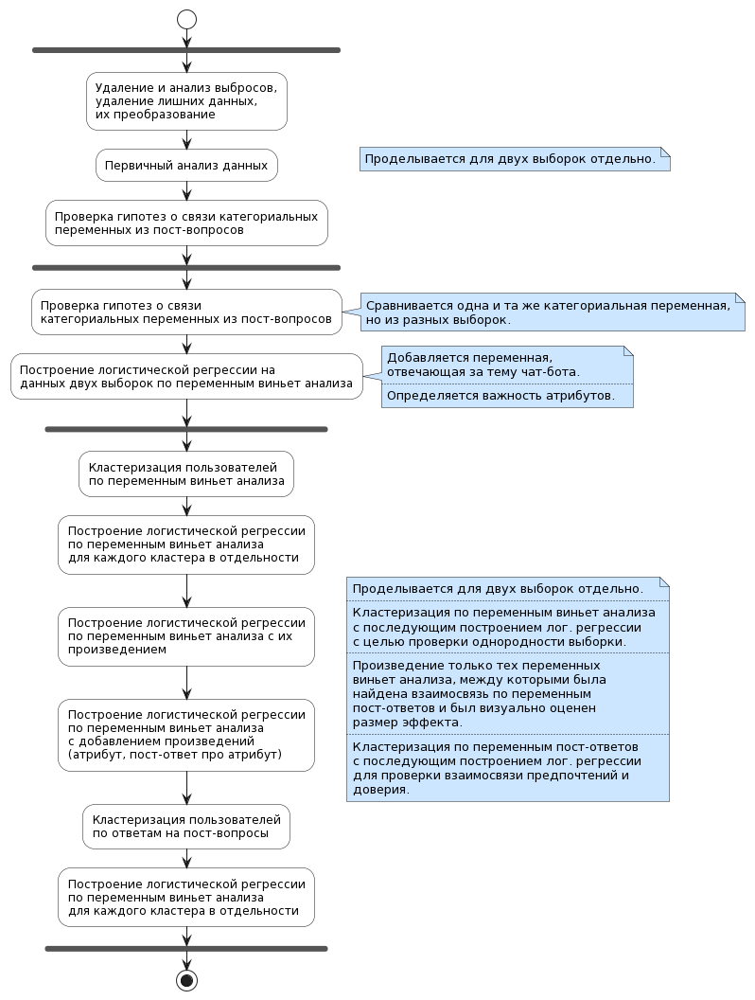

# Messages-format-and-user-trust-in-chatbots

Цель работы - определить, действительно ли пользователи доверя- ют одной и той же форме представления ответов в разной степени в зависимости от темы чат-бота, а также понять, связано ли доверие к ответу с предпочтением пользо- вателей конкретных признаков текстовой формы представления ответов.

